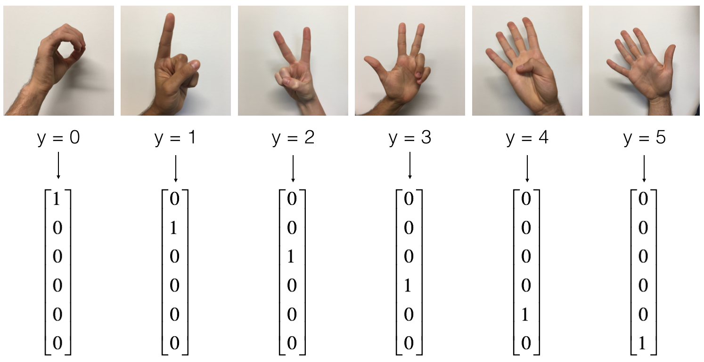

### Part 2: Decipher Sign Language Using Convolutional Neural Network

The objective is to create a model to decipher the numbers represented by the hand sign.

(Part of Andrew Ng's Coursera assignment)

- **Training set**: 1080 pictures (64 by 64 pixels) of signs representing numbers from 0 to 5 (180 pictures per number).
- **Test set**: 120 pictures (64 by 64 pixels) of signs representing numbers from 0 to 5 (20 pictures per number).

Below are examples for each number, and an explanation of representing the labels. 

_______________________________________________________________________________

###CNN Model

###Results

